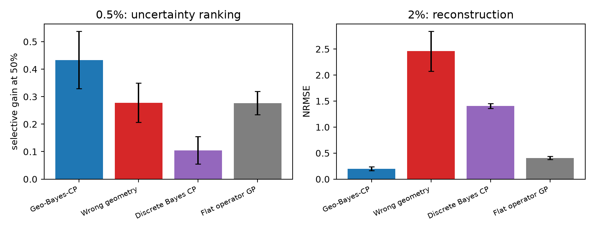
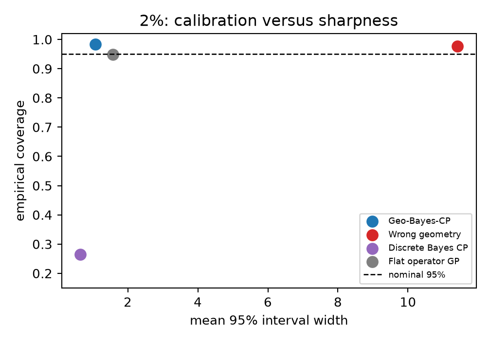

# Geometry-Aware Bayesian CP: Operator Priors for Sparse Tensor Completion

> **Status note (2026-08-13):** This is the earlier CP-centered manuscript and
> is retained as an evidence ledger, not the current canonical story. The active
> Paper-A candidate is operator-defined **Bayesian Tucker on irregular domains**.
> A first high-frequency irregular-boundary wave smoke did not achieve NRMSE
> below one, so the next pre-registered gate uses smooth elliptic/heat tensors
> before any localized-basis extension. See
> [`../zh/不规则域几何语义校正.md`](../zh/不规则域几何语义校正.md).

## Abstract

Classical Bayesian CP completion shares information across the modes of a
partially observed tensor, but treats a periodic angle, a bounded interval and a
spatial mesh as interchangeable index sets. We make Bayesian CP geometry-aware
by representing every mode factor in its own operator eigenbasis and shaping its
Gaussian prior by the associated eigenvalues. The multilinear CP decoder remains
explicit. Mode-factor means are fitted under operator priors; component weights
receive an exact conditional Gaussian posterior; a diagonal factor Laplace
correction and observation-only split scaling provide predictive uncertainty.
An operator-posterior CP-ALS warm start fixes sparse multiplicative optimization
without altering the generative model. On a fresh ten-seed rank-four tensor
experiment with 2% observations, geometry-aware Bayesian CP obtains
0.198±0.037 NRMSE, compared with 0.406±0.031 for a flat operator GP,
2.459±0.381 for identical CP with permuted geometry and 1.406±0.049 for discrete
Bayesian CP. At 0.5%, point error is neutral relative to the flat GP, but the CP
posterior gives better NLL, coverage and uncertainty-based selective prediction.
Structured missing sectors, Tucker-format mismatch and public Active Matter
remain mixed or negative. Automatic rank determination fails in this regime and
is not part of the final claim. The evidence supports a focused conclusion:
operator topology and boundary conditions can regularize traditional Bayesian
tensor factors, while low-rank compression helps only once those factors are
identifiable.

## 1. Introduction

Bayesian CP represents an order-\(M\) tensor as

\[
Y_{i_1\ldots i_M}=\sum_{r=1}^{R}a_r
\prod_{m=1}^{M}F^{(m)}_{i_mr}+\epsilon_{i_1\ldots i_M}.
\]

Its inductive bias is multilinear sharing, but ordinary factor-table priors do
not express that the first and last samples of a circle are neighbors, that a
Dirichlet factor vanishes on a boundary, or that diffusion cannot cross an
obstacle. With only 0.5--2% observations, relearning those facts from values is
unrealistic.

We retain the classical Bayesian tensor model and change only what constitutes
a plausible mode factor. Each factor is a function on its own domain, expanded
in eigenfunctions of a self-adjoint geometry/physics operator. This paper is not
a renamed graph GP: product eigenfeatures are never passed directly to a single
regressor in the proposed model; they first form \(R\) mode-factor columns and
interact only through a CP decoder.

Contributions:

1. A simple operator-spectral Gaussian prior inside traditional Bayesian CP.
2. Stable observation-only optimization through operator-posterior CP-ALS
   initialization, with the initialization source and cost explicitly reported.
3. Predictive uncertainty from the conditional component posterior and a
   diagonal mode-factor Laplace correction, calibrated using observed values only.
4. Causal ablations separating correct geometry, tensor low rank, discrete CP,
   flat operator regression and component ARD.

## 2. Method

### 2.1 Operator priors on CP mode factors

For mode \(m\), let

\[
\mathcal A_m\phi_{mk}=\lambda_{mk}\phi_{mk},\qquad
\Phi_m(i,k)=\phi_{mk}(x_i^{(m)}).
\]

We parameterize

\[
F^{(m)}=\Phi_mU_m,qquad
u_{mkr}\sim\mathcal N\!\left(0,(1+\lambda_{mk})^{-p_m}\right),
\]

and normalize every factor column to unit grid RMS, leaving \(a_r\) as its
identifiable amplitude. The likelihood is

\[
p(Y_\Omega\mid U_{1:M},a,\sigma^2)=
\prod_{\boldsymbol i\in\Omega}\mathcal N\!\left(
Y_{\boldsymbol i};\sum_ra_r\prod_m(\Phi_mU_m)_{i_mr},\sigma^2\right).
\]

Compared with an \(\prod_mK_m\)-coefficient flat spectral GP, the CP field uses
\(R+R\sum_mK_m\) latent coefficients and retains interpretable mode factors. In
the main experiment this is 256 predictive coefficients (rank 8) versus 512
retained product features for the flat GP; ordinary discrete CP uses 680.

### 2.2 Conditional Bayesian core and factor uncertainty

Given factors, define \(Z_{\boldsymbol i r}=\prod_mF^{(m)}_{i_mr}\). Then

\[
\Sigma_a=(\beta Z_\Omega^\top Z_\Omega+A)^{-1},\qquad
\mu_a=\beta\Sigma_aZ_\Omega^\top y_\Omega.
\]

The final model uses a fixed rank cap and equal component precision; our
type-II ARD ablation is discussed below. For spectral factor coefficient
\(u_{mkr}\), a diagonal Gauss–Newton approximation gives

\[
v_{mkr}^{-1}\approx (1+\lambda_{mk})^{p_m}+
\beta\sum_{\boldsymbol i\in\Omega}
\phi_{mk}(x_{i_m})^2
\left[a_r\prod_{q\neq m}F^{(q)}_{i_qr}\right]^2.
\]

The predictive variance combines \(Z\Sigma_aZ^\top\), observation noise, and a
first-order delta correction from \(v_{mkr}\).

### 2.3 Strict observation-only calibration

We deterministically split observed entries 75/25. A preliminary model,
including its operator-GP initializer and normalization, sees only the 75% fit
subset. The 25% calibration subset chooses one 95%-residual scale. We then refit
the unchanged point model on all observations and multiply its posterior standard
deviation by that scale. The flat-GP baseline receives exactly the same protocol
with its internal LOO calibration disabled.

### 2.4 Optimization, not an extra model component

Random CP optimization fails under 0.5% observations. We therefore fit a dense
operator posterior mean using observed values only, compress it with ordinary
CP-ALS, project factors into the corresponding per-mode eigenbases, and optimize
the original CP likelihood. Correct and wrong-geometry CP receive corresponding
correct and wrong-geometry initializers. The dense posterior is not retained in
the final predictor; its runtime is included.

## 3. Related-work boundary

Classical Bayesian CP with hierarchical shrinkage provides automatic rank
determination [Zhao, Zhang and Cichocki, 2015](https://arxiv.org/abs/1401.6497).
Bayesian CP with arbitrary side-information subspaces already exists
[Budzinskiy and Zamarashkin, 2022](https://arxiv.org/abs/2206.12486); we do not
claim the first Bayesian CP with side information. Our differentiator is that
the subspace is an operator eigenspace encoding topology and boundary conditions,
and eigenvalues shape frequency-dependent factor priors and uncertainty. Sparse
Bayesian Tucker models are the natural extension for data whose multilinear core
is not superdiagonal [Zhao et al., 2015](https://arxiv.org/abs/1505.02343).
Hilbert-space/operator GPs [Solin and Särkkä, 2020](https://link.springer.com/article/10.1007/s11222-019-09886-w)
are a strong non-tensor ablation and the precursor explored in the previous draft.

## 4. Experimental design

The main 20×28×36 tensor has time (Neumann interval), bounded range (Dirichlet
interval) and angle (circle) modes. Its rank-four operator factors are perturbed
by a localized non-CP interaction. Every model shares the exact mask and 10%
observation noise. We report held-out NRMSE, Gaussian NLL, 95% coverage, interval
width and RMSE reduction after retaining the 50% least uncertain points.

Baselines are: identical CP with permuted eigenfunctions; ordinary discrete
Bayesian CP; a correct-geometry flat operator GP with no low-rank factorization;
and geometry CP without/with component ARD. Primary fresh confirmation uses
seeds 10--14 at 0.5% and seeds 30--39 at 2%. Seeds 20--24 were used only in an
exploratory ratio-selection check and are excluded from confirmatory tables and
tests. The structured-gap test removes a connected periodic sector.
Tucker-generated data and public Active Matter are format/real-data stress tests.

## 5. Results





### 5.1 Fresh 2% confirmation: tensor structure and geometry both contribute

| model | NRMSE | NLL | coverage95 | width95 |
|---|---:|---:|---:|---:|
| Geometry Bayesian CP | **0.198±0.037** | **−0.158±0.180** | 0.983±0.011 | 1.080±0.251 |
| Flat geometry GP | 0.406±0.031 | 0.387±0.085 | 0.948±0.027 | 1.569±0.230 |
| Wrong-geometry Bayesian CP | 2.459±0.381 | 2.193±0.137 | 0.977±0.015 | 11.408±2.474 |
| Discrete Bayesian CP | 1.406±0.049 | 29.895±14.615 | 0.265±0.056 | 0.648±0.119 |

Geometry CP improves NRMSE over the flat GP by 51.2% (seed-bootstrap CI
45.0--57.1%) and over discrete CP by 85.9% (84.3--87.3%). All ten paired
differences have the same sign (exact two-sided paired permutation \(p=0.00195\)
for both comparisons). Its mean NLL is also lower than the flat GP (−0.158
versus 0.387, \(p=0.00195\)); a relative percentage is deliberately not used
for a metric that crosses zero. Wrong geometry attains coverage only by
intervals more than ten times wider, reflected in its poor NLL. Correct geometry
therefore matters within the same CP architecture, while the correct CP model's
advantage over the flat geometry GP isolates the tensor-structure contribution.

### 5.2 At 0.5%, point estimates are neutral but uncertainty is useful

| model | NRMSE | NLL | coverage95 | selective gain50 |
|---|---:|---:|---:|---:|
| Geometry Bayesian CP | 0.751±0.113 | **0.967±0.139** | **0.933±0.029** | **0.433±0.104** |
| Flat geometry GP | **0.725±0.038** | 1.047±0.217 | 0.882±0.063 | 0.277±0.042 |
| Wrong-geometry Bayesian CP | 1.527±0.109 | 2.281±0.328 | 0.858±0.121 | 0.278±0.072 |
| Discrete Bayesian CP | 1.424±0.079 | 84.154±16.922 | 0.335±0.020 | 0.105±0.050 |

The tensor model does not beat the flat GP on NRMSE (−3.7%, CI −12.2--5.2%).
It does improve uncertainty ranking: selective gain is 56.8% larger (CI
44.0--76.1%; exact \(p=0.0625\) at five seeds), while NLL and coverage also
improve descriptively. Thus low-rank
factors are useful for uncertainty allocation before they reliably improve the
mean.

### 5.3 Failure and scope tests

- Periodic gap, 0.5%: geometry CP 0.805 NRMSE versus flat GP 0.797; coverage is
  also worse, 0.821 versus 0.881. An entirely unseen sector remains difficult.
- Tucker-format mismatch: rank-10 geometry CP 0.928 versus flat GP 0.842. A
  Bayesian spectral Tucker core is required rather than forcing larger CP rank.
- Public Active Matter, 1% seed 0: geometry CP 1.384, wrong CP 2.300, discrete CP
  1.251 and flat GP 1.340. Geometry improves uncertainty calibration within CP
  but not point recovery.
- Random initialization at 0.5% yields about 1.18 mean NRMSE and loses badly to
  flat GP; the optimization fix is necessary.

### 5.4 ARD negative result

Type-II component ARD never prunes: effective rank equals caps 8 and 12 even
after alternating updates. It also collapses uncertainty, producing 0.10--0.16
coverage. ARD/no-ARD point predictions are effectively identical. We therefore
remove ARD from the proposed configuration rather than reporting a cosmetic
“automatic rank” claim. Robust structured variational or sampling inference is
future work.

## 6. Limitations

- The strongest point result uses a CP-plausible controlled tensor at 2%.
- The 0.5% and structured-gap regimes do not show a flat-GP point advantage.
- Factor uncertainty is diagonal Laplace plus split scaling, not a full joint
  posterior over multiplicative factors.
- Rank is selected externally; the attempted ARD fails.
- Dense operator initialization adds cost and is transductive, though it uses no
  unobserved targets and is discarded after CP initialization.
- End-to-end final-ratio time is 8.19 s per geometry-CP fit versus 0.49 s for the
  flat GP in this implementation; the compact final representation does not
  imply faster training because calibration and initialization are included.
- Public-data evidence is a single stress-test trajectory and is negative for
  point reconstruction.

### 6.1 External maze operator gate

We additionally pinned and range-extracted a 64/16/32 trajectory subset of The
Well acoustic-scattering maze. This gate is negative but informative. An
axis-averaged separable material operator overfits 1% observations: operator
Tucker obtains 1.309 held-out NRMSE, compared with 1.328 for wrong geometry,
1.489 for a flat operator, and 1.312 for parameter-matched CP. Replacing the
separable modes by a complete 2-D material graph resolves topology and numerical
validity (maximum eigen residual `1.12e-6`) but not representation: the lowest
global modes collapse to approximately zero prediction. Restricting the graph
to propagating maze paths also fails (correct Tucker 1.011).

This prevents an unsupported public-data claim. The operator is not merely a
regularizer: its spectral dictionary must cover localized wave bands. The next
Paper-A formulation is therefore a localized graph-wavelet/operator-bandpass
Tucker, not a higher-rank repetition of the rejected low-frequency model.

## 7. Reproducibility

The four iteration records and exact commands are in
[`TENSOR_ITERATIONS.md`](TENSOR_ITERATIONS.md). Full tables and paired statistics
are in [`tensor_results/TABLES.md`](tensor_results/TABLES.md), structured output
in [`tensor_results/summary.json`](tensor_results/summary.json), and code hashes
in [`tensor_results/MANIFEST.json`](tensor_results/MANIFEST.json).

```bash
export PYTHONPATH=src
/home/ubuntu/project/yanjiu/.venv/bin/python experiments/analyze_tensor_bayes.py
/home/ubuntu/project/yanjiu/.venv/bin/python -m pytest -q
```

The prior operator-GP campaign remains in the separate `ITERATIONS.md` precursor
log and its result directories; it is not evidence for the central tensor claim.
