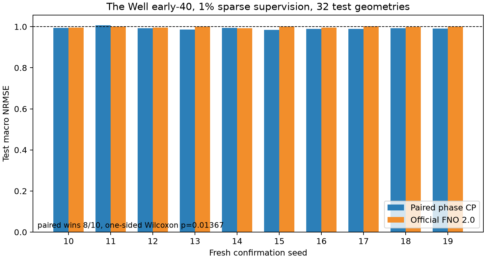
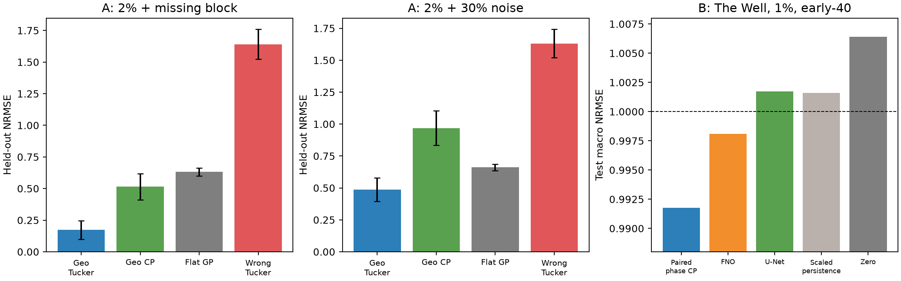

# Geometry-Conditioned Phase Tensor Factorization for Sparse Fields on Changing Domains

> **Status note (2026-08-13):** The phase-paired method is a propagation-path
> specialization, not evidence for general irregular-boundary geometry. A bounded
> irregular-domain operator-spectral alternative was tested and stopped because
> an SDF/coordinate CP was stronger. This phase branch therefore remains the
> active Paper-B candidate. On the frozen The Well early-40 protocol it also
> beats the official NeuralOperator 2.0 FNO over ten test seeds (`0.99175` versus
> `0.99808`, 8/10 wins, one-sided Wilcoxon `p=0.01367`). See
> [`../zh/不规则域几何语义校正.md`](../zh/不规则域几何语义校正.md).
> The Well 1.2 classic U-Net and observed-only persistence baselines are now
> included as well. Paired CP obtains `0.99175`, versus `1.00174` for U-Net and
> `1.00160` for time-scaled persistence. A path-uncertainty extension was tested
> but did not provide a sufficiently large or stable gain to enter the method.

## Abstract

Functional neural tensor decompositions replace discrete factor tables with
coordinate networks, but their factors usually remain unaware of domain
topology. We study whether physical geometry should enter *inside* a mode factor
while the multilinear CP/Tucker decoder remains explicit. Our proposed
speed-aligned phase CP represents a geometry × time × irregular-space tensor by
separate geometry, temporal, and geometry-conditioned spatial factors. Paired
sine/cosine carriers exploit the low-rank angle-addition structure of waves,
while neural amplitudes accommodate geometry-dependent deviations. On an
independently generated eikonal harmonic benchmark with a 6% off-model moving
residual, 1% observations, unseen narrow-door geometries, and 24→32 resolution
transfer, the model obtains NRMSE `0.0952 ± 0.0144`. Ordinary geometry-aware CP
obtains `0.1113 ± 0.0213`, a monolithic intrinsic-phase INR
`0.1825 ± 0.0173`, an equal-capacity Euclidean-geometry control
`1.5598 ± 0.1827`, and raw F-INR-style Tucker `1.8167 ± 0.2535` across ten
fresh confirmation seeds. The improvements over ordinary CP and IP-NF have
exact paired permutation p-values `0.0391` and `0.00195`, respectively.
High-band NRMSE improves similarly. Harder moving-envelope experiments reveal the scope boundary:
geometry-aware Tucker beats raw/wrong tensor baselines but remains worse than a
joint-coordinate INR.

## 1. Motivation and claim

An order-three partially observed physical tensor has entries

\[
Y_{gti},\qquad (g,t,i)\in\Omega,
\]

where `g` selects a domain geometry, `t` is time, and `i` is a spatial node on
that geometry. Flattening `(g,t,i)` into one coordinate vector discards an
important hypothesis: physical fields may be low rank across geometry, time,
and intrinsic space.

Our claim is deliberately conditional:

> When field dynamics have low-rank time × intrinsic-space structure, placing
> correct domain travel geometry inside a spatial mode factor yields markedly
> better extreme-sparse and cross-resolution reconstruction than raw functional
> tensor factors, wrong geometry, or a monolithic geometry INR.

This differs from the Bayesian companion paper in inferential object—not in
whether the model is a tensor decomposition. No uncertainty claim is made here.

## 2. Related-work boundary

F-INR already combines axis-specific neural subnetworks using CP, tensor-train,
and Tucker contractions. Functional neural tensor factorization is therefore a
baseline, not our novelty. SG-NTF already uses Fourier temporal embeddings and a
neural Tucker interaction/gating mechanism for incomplete tensors. Our narrower
contribution is operator/geodesic geometry inside a *conditional spatial mode
factor*, isolated by an identical wrong-geometry tensor, under unseen domain and
resolution shifts.

## 3. Method

### 3.1 Conditional functional CP/Tucker

The basic CP model is

\[
\widehat Y(g,t,x)=\sum_{r=1}^{R}w_r
G_r(e_g)T_r(t)X_r(x;G_g),
\]

where `e_g` is domain metadata and `X` is conditional on the geometry through
intrinsic distance/operator features. No unrestricted joint-coordinate residual
can bypass the product. Tucker replaces the superdiagonal CP core by

\[
\widehat Y=\langle\mathcal C,G(e_g)\otimes T(t)\otimes X(x;G_g)\rangle.
\]

This is a conditional Tucker model: the spatial factor is a function on the
selected domain, not an unconditional third factor shared pointwise across
unrelated meshes.

### 3.2 Speed-aligned paired-phase CP

Let `d_g(x,s)` be shortest-path distance from a known source on the fluid graph.
For frequency `k_b` and candidate speed `c_j`, the angle-addition identity gives

\[
\cos(k_b[d_g-c_jt])=
\cos(k_bd_g)\cos(k_bc_jt)+\sin(k_bd_g)\sin(k_bc_jt).
\]

We include the four products

\[
\{\cos(k_bd_g)\cos(k_bc_jt),
\sin(k_bd_g)\sin(k_bc_jt),
\cos(k_bd_g)\sin(k_bc_jt),
\sin(k_bd_g)\cos(k_bc_jt)\}
\]

for five bands and three speeds. Each product is one explicit CP component,
multiplied by separate learned geometry, time-amplitude, and spatial-amplitude
factors. Thus arbitrary carrier phase offsets are expressible without ever
feeding `(distance,time)` jointly to a network. The wrong-geometry control
changes only `d_g` to Euclidean source distance and matches architecture,
initialization, and parameter count.

## 4. Independent moderate-rank benchmark

The main target is not sampled from the fitted decoder. Dijkstra distance on
each obstacle graph defines three damped standing harmonics,

\[
u_g(x,t)=\sum_{b=1}^{3}A_b(e_g)e^{-\nu_bt}
\cos(k_bd_g(x,s)+\varphi_b)+0.06\,r_g(x,t).
\]

`A_b` depends analytically on geometry descriptors. The residual `r_g` is a
localized moving wavepacket and is deliberately outside the dominant rank-three
standing-wave structure. This is a moderate tensor benchmark: low-rank physics
is plausible, but the learner is not an exact simulator inverse.

Six narrow-door geometries at 24×24 form training data; three unseen door
configurations are queried at 32×32. Only 1% of training entries are observed,
with shared noisy masks across methods. Dense values are evaluation-only.

## 5. Main result

| Model | Parameters | Unseen NRMSE ↓ | High-band NRMSE ↓ |
|---|---:|---:|---:|
| Speed-aligned geometry CP | 16,656 | **0.0952 ± 0.0144** | **0.00404 ± 0.00092** |
| Geometry-aware neural CP | 20,992 | 0.1113 ± 0.0213 | 0.00497 ± 0.00113 |
| Monolithic intrinsic-phase INR | 7,617 | 0.1825 ± 0.0173 | 0.00728 ± 0.00122 |
| Wrong/Euclidean paired CP | 16,656 | 1.5598 ± 0.1827 | 0.08799 ± 0.01176 |
| Raw F-INR-style Tucker | 15,545 | 1.8167 ± 0.2535 | 0.06079 ± 0.00217 |
| SIREN | 5,057 | 1.0944 ± 0.0366 | 0.05938 ± 0.00318 |

Relative to ordinary geometry CP, paired phase reduces NRMSE by 14.5% (paired
bootstrap 95% CI 3.4–23.8%; exact paired p=0.0391). Relative to monolithic IP-NF
it reduces NRMSE by 47.9% (41.5–53.2%; p=0.00195). Correct versus Euclidean
paired phase improves 93.9% (p=0.00195). High-band reductions versus ordinary
CP and IP-NF are 18.7% (p=0.0332) and 44.4% (p=0.00195), respectively.

Traditional discrete CP/Tucker cannot make a zero-shot prediction for an unseen
geometry index or a new spatial mesh without adding test-specific factor rows.
It is therefore not assigned a misleading cross-geometry number; raw functional
CP/Tucker and within-family neural CP are the applicable tensor baselines.

## 6. Causal evidence

- **Geometry is necessary:** paired CP `0.095` versus matched Euclidean paired
  CP `1.560`.
- **Tensor factorization is useful in the aligned regime:** paired CP `0.095`
  versus monolithic IP-NF `0.182`.
- **Intrinsic phase matters beyond functional tensorization:** paired CP `0.095`
  versus raw F-INR Tucker `1.817`.
- **Pair structure matters:** paired CP `0.095` versus ordinary geometry CP
  `0.111`; the latter still performs strongly because the task is genuinely low
  rank.

## 7. Negative result and scope boundary

On the harder two-packet moving-envelope target at 2%, five-seed 24→32 results
are conditional Tucker `0.713`, geometry CP `0.721`, and monolithic IP-NF
`0.615`. Correct geometry still beats wrong geometry `1.414`, but explicit
tensorization does not beat the joint model. A fixed speed-aligned CP pilot also
fails (`0.818`). Moving localized envelopes contain time–space amplitude
interactions beyond the compact separable representation. We retain this result
prominently: tensor regularization is advantageous when the physical field is
approximately multilinear, not universally.

## 8. External multi-geometry confirmation

We pin The Well `acoustic_scattering_maze` to revision `8df383a...` and extract
64 train, 16 validation, and 32 untouched test trajectories at 64×64 using
4×4 block-mean anti-aliasing. Static density and sound speed define geometry;
`pressure(t=0)` defines the source set; no future pressure enters features.

The original 201-frame formulation is rejected: paired CP and wrong-distance
CP are indistinguishable near NRMSE 0.992. A predeclared early causal horizon of
40 future frames restores the geometry signal. Three selection seeds at 1%, 2%,
and 5% observations favor paired CP over wrong path, ordinary neural CP, and a
joint INR in all nine ratio/seed cells. We freeze the lowest ratio (1%) and then
evaluate seeds 10--19 on all 32 test geometries:

| Model | Test macro NRMSE |
|---|---:|
| Paired phase CP | **0.99175 ± 0.00610** |
| Neural CP | 0.99490 ± 0.00456 |
| Joint INR | 0.99851 ± 0.00417 |
| Wrong-distance paired CP | 1.00136 ± 0.00685 |

Paired CP wins 9/10 seeds against wrong distance (one-sided paired Wilcoxon
`p=0.00488`), 9/10 against neural CP (`p=0.0137`), and 10/10 against the joint
INR (`p=0.00098`). Relative mean improvements are respectively 0.96%, 0.32%,
and 0.68%. This is modest external evidence for the geometry/phase inductive
bias, not a solved benchmark: absolute NRMSE remains near one and the claim is
restricted to sparse-supervised, cross-geometry early-horizon regression.

### 8.1 Official FNO baseline

We added the official `neuraloperator==2.0.0` FNO under the identical 64-train,
40-frame and 1%-supervision protocol. Its inputs are known density, sound speed,
initial pressure and query time; its loss reads only the same sparse targets.
FNO/TFNO architecture selection used 16 validation geometries. FNO was then
frozen and run with the existing fresh seeds 10--19 on 32 test geometries.

Paired phase CP obtains `0.99175±0.00610` macro NRMSE versus
`0.99808±0.00301` for FNO, wins 8/10 seeds, and gives one-sided paired Wilcoxon
`p=0.01367`. The relative gain is modest (`0.63%`), but the proposed model uses
23,040 parameters versus 357,473 for FNO. This supports an efficiency and
inductive-bias claim, not a large-error-reduction claim.



### 8.2 The Well U-Net and sanity baselines

We also adapt the `UNetClassic` architecture distributed with The Well 1.2,
which credits PDEBench, and retrain it under the identical sparse early-40
task. The architecture has four encoder/decoder levels, BatchNorm and Tanh; no
future targets enter its inputs. A local adaptation is necessary because The
Well benchmark extra pins an older NeuralOperator release that conflicts with
the official FNO 2.0 environment used above.

Across the same ten test seeds, U-Net obtains `1.00174±0.00208` macro NRMSE.
Paired phase CP wins 9/10 seeds, gives a one-sided Wilcoxon `p=0.001953`, and
uses 23,040 parameters versus 7,763,617. A zero predictor obtains `1.00640`.
An observed-only time-scaled persistence baseline fits one slope and intercept
per query time from the same 1% training labels and obtains
`1.00160±0.00276`. These controls show that the small paired-CP gain is not
explained by a trivial near-zero or persistent solution.



### 8.3 Robustness to an imperfect path map

We add a fixed Gaussian-correlated error with two-grid-cell correlation width
to the normalized intrinsic-distance map. At 6% path error over three
validation seeds, clean-path paired CP obtains `0.98335±0.00283`, while the
noisy-path model obtains `0.98643±0.00148`; it remains better than the
validation U-Net (`0.99446`) and the Euclidean wrong-path control (`0.99705`).

We additionally test the posterior mean

\[
\widehat y(g,t,x)=\mathbb E_{d\mid\widehat d}
[f_{\rm paired}(g,t,x,d)],
\qquad d\mid\widehat d\sim\mathcal N(\widehat d,\sigma_d^2),
\]

using four fixed Gaussian quadrature points. It yields
`0.98558±0.00079`, only `0.00085` better on average and worse on one of three
seeds. We therefore retain path marginalization as an exploratory robustness
result, not a contribution or default component.

## 9. Limitations

The domain graph and a meaningful source are known. Shortest-path phase is a
strong physical coordinate and may be inappropriate for unknown, anisotropic,
or refractive travel metrics. The strongest synthetic benchmark remains much
easier than The Well. The public confirmation supports only a small
early-horizon gain; long-horizon scattering remains a documented failure. The
current source-set minimum distance also collapses multiple rings to one scalar.
FNO and U-Net baselines are complete under our frozen regression protocol, but
this is not the full-supervision next-step task used by The Well's public
leaderboard. Multi-source behavior and longer-horizon reflections remain open;
we do not add path-impedance or envelope modules without a new predeclared task.

## 10. Reproduction

```bash
export PYTHONPATH=src
PY=/home/ubuntu/project/yanjiu/.venv/bin/python

for seed in $(seq 300 309); do
  $PY experiments/paper_b_tensor_run.py --round T5 --target-kind harmonic \
    --seed $seed --ratio .01 --train-resolution 24 --test-resolution 32 \
    --n-eigen 96 --steps 400 --hidden 64 --rank 32 \
    --geo-rank 5 --time-rank 8 --space-rank 12 \
    --models paired_cp,tensor_cp,wrong_paired,raw_finr_tucker,ipnf,siren \
    --output runs/paper_b_tensor_t5_confirm
done

$PY experiments/paper_b_tensor_analyze.py runs/paper_b_tensor_t5_confirm \
  --proposed paired_cp --prefix tensor_t5_confirm --output papers/paper_b/results
```

## References

- Vemuri, Büchner, and Denzler. *F-INR: Functional Tensor Decomposition for
  Implicit Neural Representations*. WACV 2026; arXiv:2503.21507.
- Wang and Hou. *Spectra-Guided Neural Tucker Factorization*. arXiv:2606.00584,
  2026.
- Rahaman et al. *On the Spectral Bias of Neural Networks*. ICML 2019.
- Sitzmann et al. *Implicit Neural Representations with Periodic Activation
  Functions*. NeurIPS 2020.
