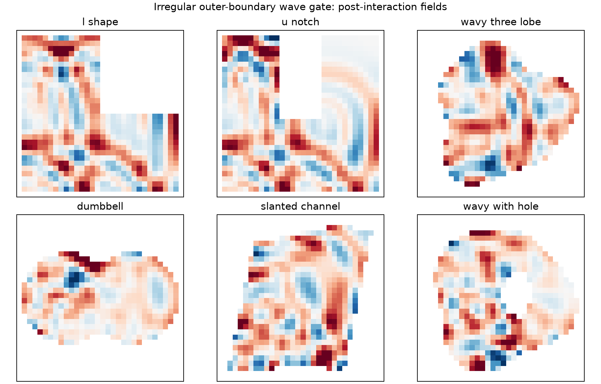
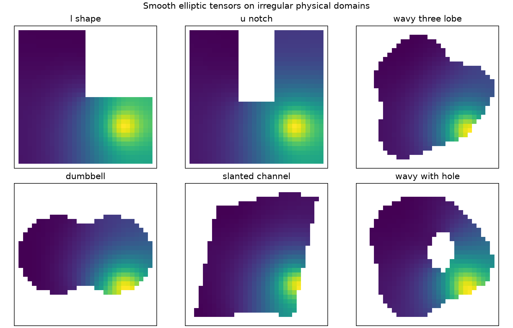

# 几何语义校正：回到不规则定义域与复杂边界

**状态：2026-08-13 已完成，结论为 NO-GO / 附录方向**

## 1. 为什么需要校正

用户最初所说的“几何感知”，首先指物理场定义在非标准区域
\(\Omega\subset\mathbb R^d\) 上：外边界可能弯曲、凹陷或分段，区域可能有孔洞，
边界条件也会改变场的传播或平滑方式。

原 Proposal A 已明确写出 `irregular domain`、`complex boundary`、FEM
eigenfunctions 和有障碍物的传播区域；原 Proposal B 也把不规则域上的 Laplacian
eigenbasis 作为 geometry-aware neural factor 的主要输入。因此，这不是新增需求，
而是当前实验叙事相对最初 proposal 发生了语义漂移。

当前代码并非完全没有不规则几何：two-room、obstacle domains、The Well maze 和
independent wave 都含内部边界或障碍物。但是多数任务仍位于规则方形外框，近期论文
叙事又把 operator topology 或 source-to-point path 本身称为 geometry，导致“域的形状
与边界”不再是第一主角。

## 2. 统一后的 geometry 定义

主文中采用以下严格定义：

> 一个样本的 geometry 是带边界条件的物理定义域
> \(\mathcal G=(\Omega,\partial\Omega,\mathcal B,\mathcal M)\)，其中
> \(\Omega\) 是不规则区域，\(\partial\Omega\) 是外边界及孔洞边界，
> \(\mathcal B\) 是边界条件，\(\mathcal M\) 是 mesh/metric。

operator、signed distance、geodesic/eikonal distance 都只是从
\(\mathcal G\) 导出的表示，不再被单独当作 geometry 的定义。

必须区分：

| 概念 | 是否属于本轮核心 geometry |
|---|---|
| 不规则外边界、凹域、孔洞、拓扑变化 | 是 |
| Dirichlet/Neumann/Robin 边界条件 | 是 |
| 不同 mesh resolution | 是，但属于离散化轴 |
| 材料系数、声速、介质场 | 不是；是 physics/operator metadata |
| source location | 不是；是 forcing/condition |
| Laplacian eigenbasis、SDF、geodesic | 不是；是 geometry representation |

## 3. 不开第三条主线

当前不建议新增 Paper C。两篇论文都可以在不改变核心张量贡献的情况下回到原始问题：

### Paper A：Irregular-Domain Operator Bayesian Tucker

一句话问题：

> 在不规则域上只有 1%--2% 观测时，能否用该域及边界条件定义的算子函数空间，
> 正则化传统 Bayesian Tucker factors？

模型仍然是

```text
irregular domain + boundary condition
             ↓
FEM/graph operator eigenfunctions
             ↓
operator-defined mode factors
             ↓
explicit Tucker core + conditional Bayesian core
```

变化主要发生在实验对象与表述，不是再发明一种模型。

### Paper B：Irregular-Domain Geometry-Phase Functional CP

一句话问题：

> 在训练和测试域的边界形状不同、节点数也不同时，能否让域内 eikonal/geodesic
> phase 进入显式 functional CP factors，实现极稀疏跨域重建？

当前 phase pairing 保留，但语义改为：边界形状改变可达路径与反射结构，
\(d_{\Omega_g}(x,s)\) 是由不规则域导出的量。

## 4. 必须采用的几何因果对照

所有对照保持 observation mask、noise、训练步数和模型容量一致：

1. **Correct boundary/operator**：在真实 \(\Omega_g\) 上构造算子或路径；
2. **Topology-erased**：把域当作其 bounding box，忽略凹口和孔洞；
3. **Wrong boundary**：使用另一不规则域的 operator/path representation；
4. **Coordinates/SDF only**：仅给坐标或 signed distance，不给 intrinsic connectivity；
5. **Discrete CP/Tucker**：只把 mesh node 当 index；
6. **Strong neural baseline**：DAFNO/GINO/Transolver 中至少一个可公平运行的实现。

关键指标除全局 NRMSE 外，还必须包含：

- boundary-band NRMSE；
- concavity/hole shadow-region NRMSE；
- unseen-shape macro NRMSE；
- 1%/2%/5% observation phase diagram；
- mesh-resolution transfer；
- Paper A 的 uncertainty calibration。

## 5. 最小数据阶梯

### Gate 1：独立 irregular-domain PDE generator

不在现有方框里只移动障碍物，而直接改变外边界：L-shape、U/notched、wavy、
dumbbell、slanted 和带孔区域。每个 case 保存 active mesh、boundary mask、SDF、
geometry operator、physics operator 和场值。solver 与 learner 代码隔离。

Gate 1 只回答三个问题：

- field 是否确实受边界影响；
- correct/wrong boundary representation 是否可构造；
- 当前 A/B 是否无需新增模块就出现几何收益。

首个 smoke gate 已构造完成并通过数值审计：6 个非规则外边界、2 个 resolution、
2 个 source，共 24 cases。可视化如下：



### Gate 2：公开数据

优先级建议：

1. [AirfRANS](https://arxiv.org/abs/2212.07564)：变化的 airfoil 内边界、非结构点云，
   有官方数据与基线；适合 Paper B 外部验证，也可构造单域稀疏重建任务。
2. [DAFNO](https://arxiv.org/abs/2305.00478) 公开的 irregular-domain benchmarks：
   同时提供直接针对不规则域的强 baseline。
3. [GINO](https://arxiv.org/abs/2309.00583)：作为 varying-geometry operator baseline，
   不要求把它改写成我们的张量方法。

AirfRANS 下载和训练成本较高，先通过 Gate 1 再进入 Gate 2。

## 6. 第一轮方法 gate：证明不能只改 storytelling

在完全不修改现有方法的条件下，已经完成 1% 和 2% smoke。Paper A 在每个域上把
`source × time × active node` 作为三阶张量；Paper B 用四个训练域，在未见的
`slanted_channel` 上做 24→32 resolution validation。带孔 test 域没有被 Paper B 读取。

### Paper A

| 观测率 | Correct Tucker | Wrong-boundary Tucker | Topology-erased Tucker | Correct CP |
|---:|---:|---:|---:|---:|
| 1% | 1.551 | 1.819 | 1.604 | **1.108** |
| 2% | 1.766 | 1.949 | 1.722 | **1.110** |

correct operator 相对 wrong operator 有方向性收益，但绝对 NRMSE 大于 1，Tucker 也明显
差于 CP。2% 没有改善说明当前 wave target、global low modes 和 Tucker optimization 的
组合不适合作为“边界几何有效”的首个证据。

### Paper B

| 观测率 | Correct phase CP | Wrong Euclidean phase | Neural CP | Joint INR |
|---:|---:|---:|---:|---:|
| 1% | 1.091 | **1.037** | 1.166 | 1.037 |
| 2% | 0.999 | **0.974** | 1.057 | 1.003 |

在未见不规则外边界上，correct geodesic phase 没有优于 wrong Euclidean phase。这说明
当前 phase CP 感知的是特定传播对齐，而不是一般意义上的复杂边界。不能只通过改写摘要
把它变成原始 proposal 的不规则域方法。

### gate 后的决策修订

1. **Paper A 保持主线，但更换首个验证任务。**先用不规则域上的 smooth elliptic/heat
   tensor 验证 boundary-aware operator prior，再把高频 wave 作为压力测试。
2. **Paper B 回到原 proposal 的 operator-spectral neural factor。**用域 Laplacian/FEM
   features 定义 functional factors，并与 bbox Fourier、SDF-only、wrong-domain 对照。
3. **Phase CP 降为未确认的专门化分支。**此前 The Well early-horizon 的微小差异经
   绝对效果复核后已改判失败，不再作为正信号，也不承担“一般不规则边界 geometry” claim。
4. **仍不新开 Paper C。**先在 Paper B 内比较 `operator-spectral` 与 `phase` 两个 branch，
   只把真正通过不规则域 gate 的版本升为主线。

## 7. 本轮停止条件

本轮不增加 graph wavelet、learned boundary encoder 或 path impedance。先原样运行当前
A/B 核心。如果在 1%--2% 下：

- correct geometry 稳定优于 topology-erased/wrong geometry；
- 至少一个不规则边界区域 NRMSE 明显改善；
- B 能跨未见外边界或 mesh resolution；

则证明现有方法只是实验语义需要校正。若 correct/wrong 几乎无差异，才说明方法本身
尚未真正感知边界，需要重新讨论局部谱基或 boundary-conditioned factors。

## 8. 对当前项目定位的修订

两篇共享的核心思想改为：

> 不规则定义域及其边界条件不只是网络输入；它们通过域上算子或域内传播坐标，
> 改变传统 Bayesian/functional tensor factors 的定义方式。

operator geometry 是主实现；phase geometry 只有在边界形状确实改变有效传播结构、且
correct/wrong control 通过时，才可以称为不规则域几何的实现。

## 9. 最终退出实验：smooth elliptic 也不支持主线贡献

为了排除上一轮 wave target 与 global spectrum 不匹配，我们构造了更有利于 operator
prior 的 screened elliptic tensor：`source × diffusivity × irregular-domain node`。
solver 使用 weighted PDE operator，learner 只使用 unweighted domain operator，避免同源
eigenbasis 泄漏。6 个域、24/32 两种分辨率全部通过线性残差与有限性审计。



### Paper A 单域 1% completion

| 方法 | Macro NRMSE | Boundary NRMSE |
|---|---:|---:|
| Correct operator CP | 0.668 | 0.733 |
| Topology-erased CP | 0.847 | 1.027 |
| Wrong-boundary CP | 1.315 | 1.311 |
| Correct operator Tucker | 0.895 | 0.977 |
| Coordinate functional CP | **0.180** | 0.229 |
| SDF functional CP | **0.180** | **0.215** |

correct operator 确实优于 wrong/bounding-box operator，因此代码没有完全忽略边界；但
普通 coordinate/SDF CP 误差只有约四分之一。这个任务不能证明 operator geometry 是
必要创新，Tucker 也没有胜过 CP。

### Paper B 跨未见域与 24→32 transfer

| 方法 | Validation NRMSE | Boundary NRMSE |
|---|---:|---:|
| Operator-spectral functional CP | 0.278 | 0.282 |
| Topology-erased spectral CP | 0.324 | 0.348 |
| Wrong-boundary spectral CP | 1.023 | 1.006 |
| SDF/coordinate functional CP | **0.181** | **0.226** |

增加 spectrum modes 从 32 到 64 没有改变结论。operator-spectral CP 能 transfer，但不如
更简单的 SDF/coordinate CP。

## 10. 正式决策

触发预注册退出条件：

1. 不规则边界不再作为 Paper A 或 Paper B 主线；
2. 不继续 graph wavelet、boundary encoder、FEM refinement 或 AirfRANS 大规模下载；
3. 以上结果保留为 negative/diagnostic appendix；
4. Paper A 回到已有强证据的 operator Bayesian Tucker controlled mechanism；
5. Paper B 回到 phase-paired CP 的传播路径几何，并严格限定为 aligned early horizon；
6. “geometry”在最终写作中必须加限定词：`operator geometry`、`boundary geometry` 或
   `propagation-path geometry`，不再混用。

放弃该分支不是因为无法得到正数，而是因为简单 baseline 更强，继续投入会使贡献变得
不够独特并重新走向 over-design。
