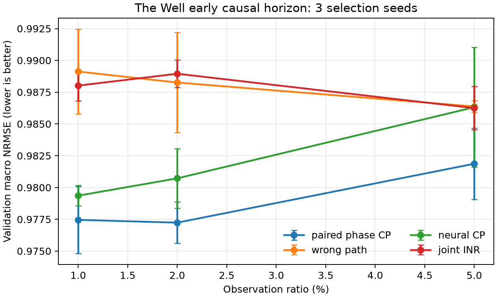
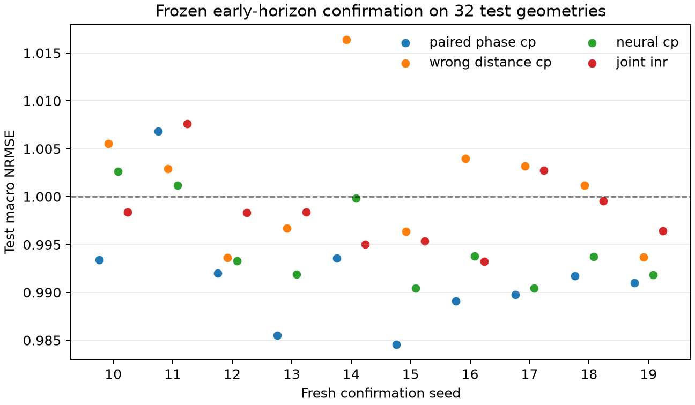
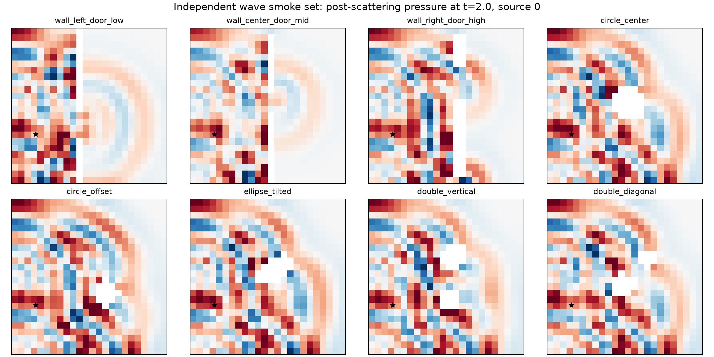

# 几何感知张量学习：最新版本故事线与进展总报告

**版本日期：2026-08-13**

**用途：论文主线审阅、下一阶段决策，不是实验流水账**

---

## 0. 先给结论

当前项目不是“一套越来越复杂的方法”，而是两篇彼此独立、共享实验纪律的论文：

| | Paper A | Paper B |
|---|---|---|
| 一句话问题 | 如何把传统 Bayesian Tucker 的 mode factors 变成由物理算子定义的几何函数？ | 如何把传播几何与时间相位放进显式 CP factor，而不是交给联合 MLP 自己学习？ |
| 当前核心方法 | **Operator-Geometry Bayesian Tucker** | **Geometry-Phase Paired Functional CP** |
| 核心贡献对象 | 传统 Bayesian tensor decomposition | 传统/functional neural tensor decomposition |
| 最强正信号 | 2% 观测下 NRMSE `0.125±0.015`，明显优于 CP、flat GP、wrong geometry | synthetic 强机制结果；The Well early-40/1% 上有小但十 seed 稳定的外部收益 |
| 当前最大缺口 | 公共复杂几何上的 operator dictionary 仍不够好 | 官方 GINO/TFNO/FNO/U-Net baseline 尚未补齐，绝对误差仍接近 1 |
| 投稿准备度 | **方法主线成立，外部证据不足** | **主线成立，已有初步外部证据，baseline 不完整** |

最重要的收敛决策是：

1. Paper A 不再讲“一个通用 operator GP 系统”，而讲**算子如何进入显式 Bayesian Tucker factors**。
2. Paper B 不再讲宽泛的 Neural Spectral Adapter，而讲**空间传播相位与时间相位如何通过显式 CP product 配对**。
3. phase envelope、The Well 低频 graph Tucker、长时域 201-frame 版本都是探索负结果，不是主方法组件。
4. 下一步不应该继续叠新模块。Paper A 先验证当前方法的独立数据证据；Paper B 先补强 baseline。

因此，项目曾经出现过 over-design 倾向，但现在可以通过“冻结主方法、删除旁支、只补证据”重新压回清晰论文结构。

---

## 1. 两篇论文的最终故事地图

### 1.1 Paper A：Operator-Geometry Bayesian Tucker

> **核心故事：**传统 Bayesian Tucker 把 mode 当成普通离散 index；我们用定义域上的物理/几何算子定义 factor space 和频率相关先验，使 Tucker 在极低观测率下能够沿正确 topology、boundary 和 smoothness 共享信息。

最小方法链条只有四步：

```text
mode geometry / boundary
        ↓
mode operator A_m = Phi_m Lambda_m Phi_m^T
        ↓
geometry-aware factor U_m = Phi_m W_m
        ↓
explicit Tucker core + conditional Gaussian posterior
```

对应模型可以压缩写成：

```text
Y_hat(i1,...,iM)
  = < G, U_1(i1) ⊗ ... ⊗ U_M(iM) >,

U_m = Phi_m W_m,
prior(W_m[k]) ∝ (1 + lambda_m[k])^(-p).
```

这里真正的 contribution component 是：

1. **Operator-defined factor space**：几何不是附加 feature，而是决定 factor 可以在哪个函数空间变化。
2. **Explicit Tucker structure**：保留可检查的 multilinear core；CP 是对角/超对角 core 特例。
3. **Bayesian core uncertainty**：条件于几何正则化 factors，对小 Tucker core 做解析 Gaussian posterior。
4. **Causal geometry controls**：correct、wrong/permuted、flat、discrete operator 与 observation-matched CP/Tucker 对照。

需要严格限定的地方：当前不是 fully Bayesian factors。准确表述应是：

> **operator-regularized MAP factors with a conditional Bayesian Tucker core**。

这比泛称“fully Bayesian geometry tensor”更可信，也足以构成论文。

### 1.2 Paper B：Geometry-Phase Paired Functional CP

> **核心故事：**波传播中的关键结构不是普通坐标平滑，而是空间 travel distance 与时间 phase 的配对；我们把二者放入分离的 spatial/time factors，仅通过显式 CP contraction 相乘，从而在未见 geometry 上保留 tensor inductive bias。

最小方法链条是：

```text
geometry + source
        ↓
intrinsic travel coordinate d_g(x,s)
        ↓
separate spatial carrier and temporal carrier
        ↓
explicit paired CP contraction
```

核心相位恒等式：

```text
cos(k[d_g - c t])
  = cos(k d_g) cos(k c t) + sin(k d_g) sin(k c t).
```

模型不需要一个 joint `(distance,time)` MLP 来重新发现该结构。当前 contribution component 是：

1. **Geometry-conditioned functional factor**：spatial factor 可在未见 mesh/geometry 上查询。
2. **Explicit phase pairing**：空间与时间只通过 CP product 交互，没有 unrestricted joint residual 绕过 tensor structure。
3. **Matched wrong-geometry control**：只把 intrinsic path 改成错误/Euclidean path，架构与参数量不变。
4. **Scope/phase diagram**：明确指出 aligned early propagation 有利，强 mismatch、moving envelope 和长时多反射会失败。

phase envelope 不属于当前 contribution。它是一次合理但失败的增强，应留在 appendix/negative result。

---

## 2. 与最初两份 proposal 的重大变化

这不是“原 proposal 的直接代码化”，而是经过实验证伪后的明显重构。

### 2.1 初始 Proposal A → 当前 Paper A

最初 proposal 的中心是：

```text
domain geometry → operator → eigenbasis → spectral GP prior
                → Bayesian functional tensor factorization
```

它强调从 operator 而不是手工 kernel 出发，数学动机是对的，但论文对象仍较宽：GP、operator prior、functional tensor、不同 domain 都可能成为主角。

当前版本做了三个大变化：

| 变化 | 初始设想 | 当前版本 | 为什么改变 |
|---|---|---|---|
| 主模型 | operator-spectral GP/BFT 的宽框架 | 显式 operator Bayesian Tucker | dense GP 能证明几何有用，但不能证明 tensor decomposition 有用 |
| tensor core | CP/Tucker 都是可能形式 | Tucker 为主、CP 为受限特例 | CP 在 Tucker truth 上明显欠表达，继续加 CP rank 不是正确修复 |
| Bayesian 范围 | 容易被理解为全模型 Bayesian | factors 为 geometry-regularized MAP，core 为 conditional Bayesian | 这是当前实现真正支持的 claim，避免过度宣称 |

所以 Paper A 的贡献已经从“提出一种几何 GP prior”变成：

> **把 mode-specific physical operator 内生到传统 Bayesian Tucker factorization。**

### 2.2 初始 Proposal B → 当前 Paper B

最初 neural proposal 提供了三条宽路线：

- Operator-Spectral Neural Factor；
- Geometry-Conditioned Neural Field Factor；
- Neural Operator Tensor Decoder。

它进一步建议 Neural Spectral Adapter、learned spectral filter 和可选 residual network。这些方向合理，但放在一篇论文里会导致 contribution 不清楚，也容易退化成普通 INR/neural operator。

当前版本进行了更大的收窄：

| 变化 | 初始设想 | 当前版本 | 为什么改变 |
|---|---|---|---|
| 神经组件 | learned spectral adapter / residual | 小型 factor networks + 固定 paired phase carrier | contribution 更可解释，不能由 joint network 绕过 |
| tensor 结构 | CP/Tucker/neural decoder 均可 | paired functional CP 为主 | 一句话可以说清创新对象 |
| geometry 表示 | operator eigenfeatures 的通用编码 | source-to-query intrinsic travel coordinate | 波传播任务上机制更直接 |
| 任务范围 | 通用 geometry-aware neural tensor | aligned/early-horizon sparse wave reconstruction | phase pairing 在长时多反射上不再可靠，必须限定 scope |

所以 Paper B 已经不再是“通用 Neural Spectral Prior”论文，而是：

> **一个针对传播场、通过显式 CP phase pairing 实现几何感知的 functional tensor 方法。**

这是一项实质性改变，不应在写作中假装仍是原 proposal 的平滑延伸。

---

## 3. Paper A 当前证据做到哪一步

### 3.1 最清楚的正信号

在 operator-Tucker controlled tensor、10 个全新 seed 上：

| 观测率 | Geo-BTucker | Geo-CP | Flat operator GP | Wrong BTucker | Discrete BTucker |
|---:|---:|---:|---:|---:|---:|
| 1% | **0.676±0.072** | 0.809±0.072 | 0.752±0.030 | 1.462±0.097 | — |
| 2% | **0.125±0.015** | 0.367±0.055 | 0.612±0.028 | 1.712±0.201 | 1.976±0.131 |

2% 时：

- 相对 geometry CP 改善 65.9%；
- 相对 flat operator GP 改善 79.6%；
- 相对 wrong geometry 改善 92.7%；
- 三个 paired permutation test 均为 `p=0.001953`。

这组实验已经形成清晰因果链：

```text
Tucker > CP       → explicit non-diagonal core 有价值
correct > wrong   → 正确 geometry/operator 有价值
Tucker > flat GP  → 收益不只是 operator feature，而包含 tensor structure
```


### 3.2 负信号及其含义

The Well 上已测试：

1. x/y 可分离平均算子；
2. 完整 2D material graph 最低 eigenmodes；
3. 传播通道子图最低 eigenmodes。

这些版本都没有得到 held-out NRMSE `<1`，correct operator 也没有稳定优于 matched CP。该结果不是 Paper A 主线被否定，而是说明：

> The Well 的局部高频散射不能由少量最低全局 eigenmodes 表达。

但这里必须停止自动加模块。graph wavelet/bandpass 是一个可能修复，不应在没有更简单独立数据证据前直接升级为主方法。

### 3.3 Paper A 当前论文状态

可以支持的 claim：

- operator geometry 可以显著改善传统 Bayesian Tucker 的极稀疏重建；
- 显式 Tucker core 与正确 operator 都是必要组件；
- wrong/no geometry 会产生明确退化。

还不能支持的 claim：

- 在复杂公共 scattering geometry 上普遍有效；
- fully Bayesian factors；
- 自动 rank determination；
- 比所有 graph tensor completion 方法更好。

因此 Paper A 是“**核心方法成立，但外部验证尚未闭环**”。

---

## 4. Paper B 当前证据做到哪一步

### 4.1 controlled mechanism evidence

在独立 moderate-rank wave benchmark、1% observed、未见 geometry 和 24→32 resolution transfer 上：

| 方法 | Unseen NRMSE |
|---|---:|
| Paired phase CP | **0.0952±0.0144** |
| Geometry neural CP | 0.1113±0.0213 |
| Joint intrinsic-phase INR | 0.1825±0.0173 |
| Wrong/Euclidean paired CP | 1.5598±0.1827 |

这是很强的机制结果：正确 path、显式 pairing、tensor structure 三者都能被 matched control 分离。

但 moving-envelope target 上 IP-NF 更好；phase-envelope 增强也没有超过 IP-NF。因此论文 scope 必须是：

> paired phase tensor 在传播结构近似 multilinear/aligned 时有优势，不宣称对任意 moving field 普遍最优。

### 4.2 The Well 外部数据正信号

完整 201 个 future frames 上，correct/wrong path 几乎没有差异，所以该 formulation 已被拒绝。

冻结为 early-40 causal horizon 后，三 selection seeds × 1%/2%/5% 的九个 cells 中，paired CP 全部优于 wrong path、neural CP 和 joint INR：



随后固定 1%、horizon=40、500 steps，用全新 seeds 10–19 在此前未触碰的 32 个 test geometry 上确认：

| 方法 | Test macro NRMSE | paired 胜场 | 单侧 Wilcoxon p |
|---|---:|---:|---:|
| Paired phase CP | **0.99175±0.00610** | — | — |
| Neural CP | 0.99490±0.00456 | 9/10 | 0.0137 |
| Joint INR | 0.99851±0.00417 | 10/10 | 0.00098 |
| Wrong path | 1.00136±0.00685 | 9/10 | 0.00488 |



这组结果应该如何解读：

- **正面：**收益在新 seed、新 test geometry 上保持，correct/wrong geometry 有统计意义。
- **克制：**相对改善只有约 0.3%–1.0%，绝对 NRMSE 仍接近 1。
- **正确 claim：**获得了初步外部 geometry inductive-bias evidence。
- **错误 claim：**“显著解决了 The Well acoustic scattering”。

### 4.3 Paper B 当前论文状态

Paper B 比 Paper A 更接近一个闭环故事：

```text
明确机制 → matched geometry control → synthetic 强结果
         → mismatch failure boundary → public-data modest confirmation
```

当前主要缺口不是再设计方法，而是同一协议下的 GINO/TFNO/FNO/U-Net baseline，以及 source/path 误差 ablation。

---

## 5. 数据和实验协议：共享，但不是第三篇贡献

两篇论文共享以下 discipline：

- observation ratio：核心为 1%–2%，补充 5%；
- correct/wrong/no geometry controls；
- selection seed 与 confirmation seed 分离；
- test 只在 configuration frozen 后读取；
- 同一 mask、noise、metric 和参数/compute 报告；
- negative result 与 reopen condition 注册。

目前数据链包括：

1. controlled tensor：验证 mechanism 与因果组件；
2. independent wave solver：避免 learner/simulator 同源；
3. The Well acoustic maze：公共多几何压力测试。



The Well 固定 revision `8df383a...`，最终采用 4×4 block-mean 下采样；112/112 trajectory 的初始 source 均被保留。数据门禁、checksum 和 split 是可信度基础，但不应抢占论文 contribution。

---

## 6. 哪些内容应该从主故事删除或降级

为了避免 over-design，建议正式执行以下裁剪：

| 内容 | 决策 | 放置位置 |
|---|---|---|
| Paper A dense operator GP | 保留为强 baseline，不作为 proposed method | Main experiment |
| Paper A Bayesian CP 历史版本 | 保留为 Tucker restricted-core baseline | Main ablation |
| ARD 自动 rank | 删除 claim | Negative appendix |
| fully Bayesian factors | 不宣称 | Limitation / future work |
| The Well separable/full/channel low-mode graph Tucker | 不再继续调 rank | Negative appendix |
| graph wavelet/bandpass | 暂不进入主方法 | 仅在独立数据仍失败时再审议 |
| Paper B phase envelope | 从主方法删除 | Negative appendix |
| 通用 Neural Spectral Adapter | 不作为当前论文贡献 | Related/future direction |
| 201-frame The Well long-horizon | 保留为 scope failure | Main limitation |
| multi-source path impedance | 暂不叠加 | 官方 baseline 后再决定 |

主文中每篇 proposed method 最多保留一个结构图、一个核心公式、三个 contribution bullets。

---

## 7. 最小、清晰的下一步

### 7.1 Paper A：先补证据，不先改方法

**推荐下一实验：**把当前 Operator Bayesian Tucker 原样用于 independent wave 数据的一个预注册 tensorization，并只比较：

```text
Geo-Tucker / Geo-CP / flat operator / wrong operator / discrete Tucker
```

只跑 seed 0、1% 和 2% 作为 gate。成功标准：

- correct Geo-Tucker held-out NRMSE `<1`；
- 同时优于 wrong operator 和 observation-matched CP；
- 不需要 graph wavelet 才出现正确几何差异。

只有这个 gate 失败，才讨论 localized graph-wavelet。这样最接近原 proposal，也最能防止 over-design。

### 7.2 Paper B：冻结方法，补 reviewer baseline

**推荐下一实验：**在已经冻结的 The Well early-40/1% protocol 上加入：

- FNO / TFNO；
- GINO（如果 geometry/operator 输入协议可以公平适配）；
- The Well 官方 U-Net/ConvNeXt U-Net；
- persistence/mean sanity baseline。

当前 paired CP 不再加 envelope、不改 hidden size、不加 path impedance。先回答：

> 在公平 compute 和相同 sparse supervision 下，0.99175 的小收益是否仍能超过强 operator baseline？

如果答案是肯定的，再做 source/path noise ablation；如果否定，则 Paper B 保留为 controlled mechanism paper，而不是继续叠模块追分。

### 7.3 写作清理

下一轮代码实验之前，应先完成：

1. Paper A 标题与正文统一从 CP 更新为 Tucker；
2. 每篇建立一页 contribution/claim table；
3. 把第四至第六轮的过程性细节移到 appendix/ledger；
4. 主 README 只指向本报告、两篇 draft 和复现入口。

---

## 8. 现在需要审阅的三个决定

### 决定 A：是否同意 Paper A 暂停 graph-wavelet

**我的建议：同意。**先用当前方法完成 independent-wave gate；它比继续改 dictionary 更接近原始 operator-spectral tensor proposal。

### 决定 B：是否接受 Paper B 的 early-horizon scope

**我的建议：接受，但明确是 early-horizon sparse cross-geometry reconstruction。**长时域失败应主动报告，而不是隐藏。

### 决定 C：下一阶段资源放在哪里

**我的建议优先级：**

1. Paper B 官方 baselines；
2. Paper A independent-wave current-method gate；
3. 两篇写作和主表清理；
4. 最后才是 multi-source/path impedance 或 graph wavelet。

---

## 9. 最终定位

项目从最初的两个宽 proposal，已经收敛成两条更窄、更能发表的主线：

> **Paper A：让传统 Bayesian Tucker 的 factor space 由 mode geometry operator 定义。**

> **Paper B：让传统 functional CP 通过显式空间—时间 phase pairing 感知传播几何。**

两篇真正共享的核心思想是：

> 几何不应只是输入特征；它应改变张量 factors 的定义方式、可表达函数空间或 contraction structure。

当前不是“方法越做越复杂”的阶段，而应进入“冻结核心、删减旁支、补齐最关键证据”的阶段。
