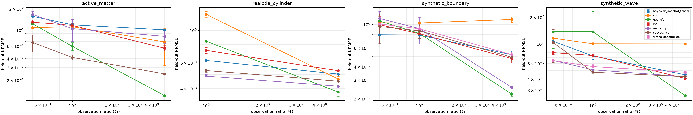

# Geometry-Aware Tensor implementation and POC report

Date: 2026-08-12
Hardware: NVIDIA A100-SXM4 80GB
Software used for the recorded runs: Python 3.12, PyTorch 2.11.0+cu128

## Executive result

Both proposal directions now have complete, runnable implementations and at
least one reproducible positive regime. The result is promising but conditional:

- **Version 1, Bayesian operator-spectral tensor**, is best on the controlled
  Dirichlet×periodic field at 0.5% and 1% observations. At 0.5%, its NRMSE is
  `0.798 ± 0.100`, versus `0.994 ± 0.194` for the best ordinary baseline
  (SIREN), a 19.7% reduction. Its 95% coverage is `0.887 ± 0.048`: informative,
  but still under-calibrated.
- **Version 2, Geo-NFT**, is best at 5% observations on every dataset tested. It
  reaches `0.122 ± 0.003` NRMSE on public Active Matter, versus `0.560 ± 0.050`
  for the best non-geometric neural baseline; on real cylinder PIV it reaches
  `0.379 ± 0.025`, versus `0.415 ± 0.002` for neural CP.
- In the harsher 0.5%–1% regime on Active Matter, the small deterministic
  spectral CP is strongest (`0.676 ± 0.181` and `0.416 ± 0.034`). This shows
  that strong fixed geometric shrinkage is preferable to a nonlinear adapter
  until enough observations exist.
- Negative results matter: the Bayesian Tucker truncation underfits complex
  3-D Active Matter; Geo-NFT is unstable below 1% on the 3-D synthetic wave;
  and neural CP wins RealPDE at 1%. The present POC does not support a blanket
  claim that geometry awareness always wins.



Full means, sample standard deviations, parameter counts and uncertainty metrics
are in [the generated result tables](results/RESULTS.md).

## What changed from the two proposals

### Version 1: exact Bayesian spectral core

The direct mean-field Bayesian CP requested by the first proposal is implemented
as `BayesianSpectralCP`. Pilot runs exposed a structural optimization problem:
independent Gaussian posteriors over multiplicative factors have reciprocal
scale symmetries and produce noisy products in the extreme sparse regime.

The primary POC therefore uses a stronger formulation,
`BayesianSpectralTensor`:

1. Build the product operator basis from mode-specific eigenfunctions.
2. Rank product features by joint operator energy
   `lambda_joint = sum_m lambda_m`.
3. Keep a compact low-energy Tucker core.
4. Place `w_k ~ N(0, [alpha(1+lambda_k)^p]^-1)` on that core.
5. Select `(alpha, p, noise)` by a small predeclared evidence grid.
6. Compute the Gaussian posterior exactly in float64 feature space.

This is not a cosmetic implementation change. It removes avoidable VI error,
gives an exact posterior for the selected subspace, and turns the GP motivation
into an `O(NK^2 + K^3)` feature-space method. The original Bayesian CP remains
available for future structured-variational work.

### Version 2: normalized Geo-NFT

`GeoNeuralTensor` uses mode-wise factors

```text
F_m(x) = Phi_m(x) A_m + sigmoid(g_m) MLP_m(Phi_m(x)).
```

The implementation adds two safeguards missing from the initial note:

- each factor is RMS-normalized on its domain grid, removing CP's reciprocal
  scale degeneracy;
- operator energy is applied to the complete neural factor, including the
  nonlinear residual, so the MLP cannot route around the geometry penalty.

The residual gate starts near zero. This realizes the intended behavior:
spectral structure first, nonlinear correction only when data supports it.

## Experimental protocol

Every method uses the same seeded mask and the same noisy observed values.
Normalization statistics are computed only from observations. Metrics are
computed only on the complement of the observation mask. No dense target values
are used for training, early stopping, hyperparameter selection, or model-specific
preprocessing.

Primary metric is NRMSE (`RMSE / held-out standard deviation`). This is essential
for Active Matter, whose concentration has a large mean near one; plain relative
L2 would make a constant predictor look artificially good. We also record RMSE,
MAE, observed RMSE, periodic seam error, parameter count, and for Bayesian models
NLL, 95% coverage, predictive standard deviation, and uncertainty/error Spearman
correlation.

The recorded random-mask campaign contains 216 fits: 3 seeds, observation rates
0.5%/1%/5% (RealPDE: 1%/5%), and all applicable methods. Observation noise is
10% of the observed-value standard deviation. An additional 18-fit periodic-gap
campaign brings the total to 234 fits.

## Main quantitative results

| Dataset | Obs. | Best proposal/geometry model | NRMSE | Best ordinary baseline | NRMSE | Reduction |
|---|---:|---|---:|---|---:|---:|
| Boundary×circle sanity | 0.5% | Bayesian spectral tensor | 0.798 | SIREN | 0.994 | 19.7% |
| Boundary×circle sanity | 1% | Bayesian spectral tensor | 0.794 | SIREN | 0.817 | 2.8% |
| 3-D wave sanity | 1% | Spectral CP | 0.479 | Neural CP | 0.510 | 6.0% |
| 3-D wave sanity | 5% | Geo-NFT | 0.260 | SIREN | 0.407 | 36.0% |
| The Well Active Matter | 0.5% | Spectral CP | 0.676 | Discrete CP | 1.086 | 37.8% |
| The Well Active Matter | 1% | Spectral CP | 0.416 | Neural CP | 1.055 | 60.5% |
| The Well Active Matter | 5% | Geo-NFT | 0.122 | SIREN | 0.560 | 78.2% |
| RealPDE cylinder PIV | 1% | Neural CP (baseline) | 0.487 | Spectral CP | 0.531 | proposal loses 9.2% |
| RealPDE cylinder PIV | 5% | Geo-NFT | 0.379 | Neural CP | 0.415 | 8.8% |

“Ordinary baseline” means the best of discrete CP, SIREN, and raw-coordinate
neural CP. Spectral CP is listed as a geometry ablation rather than one of the two
headline versions.

## Interpretation

The experiments support three narrower claims.

1. **Correct low-energy coordinates are a strong sample-efficiency prior.** The
   496-parameter spectral CP beats 8.6k-parameter SIREN and 14.4k-parameter neural
   CP on Active Matter at 0.5% and 1%.
2. **Neural adaptation becomes useful after the geometric scaffold is
   identifiable.** Geo-NFT dominates at 5%, but its extra capacity is harmful in
   several 0.5% cases.
3. **Exact Bayesian inference helps only when truncation bias is controlled.** It
   wins the low-joint-spectrum 2-D sanity check and supplies useful uncertainty,
   but its finite Tucker basis underfits higher-complexity 3-D fields.

The RealPDE 1% loss is also diagnostic: the current separable rectangle basis
does not encode the cylinder obstacle, and treating 48 subsampled frames as one
period is only an approximation. Calling this “geometry-aware” without an
obstacle-domain graph Laplacian would overstate the implementation.

The periodic-gap ablation is similarly nuanced. At 5% on the boundary×circle
field, correct spectral CP (`0.596 ± 0.065`) improves over wrong-geometry CP
(`0.630 ± 0.059`), but raw neural CP is still best (`0.387 ± 0.030`). Thus the
topology choice has measurable directionality, but basis correctness alone does
not replace adequate nonlinear capacity.

## Reproduction

From the repository root, use the CUDA environment already present on this host:

```bash
export PYTHONPATH=src
PY=/home/ubuntu/project/yanjiu/.venv/bin/python

$PY -m pytest -q

$PY experiments/run_poc.py \
  --dataset active_matter \
  --models cp,inr,neural_cp,spectral_cp,bayesian_spectral_tensor,geo_nft \
  --ratios 0.005,0.01,0.05 --masks random --seeds 0,1,2 \
  --rank 8 --hidden 64 --steps 2200 --reg-weight 0.01 \
  --noise-std 0.1 --output runs/final_active

$PY experiments/aggregate_results.py \
  runs/final_boundary runs/final_boundary_gap runs/final_synthetic \
  runs/final_active runs/final_realpde \
  --output reports/results
```

Raw run artifacts and per-method figures are under `runs/` locally and are
git-ignored because they are generated. Compact aggregate CSV/JSON/Markdown and
the scaling figure are versioned under `reports/results/`.

## Next research iteration

Highest-value improvements are:

1. Build a graph/FEM Laplacian on the actual cylinder-fluid domain and compare it
   against the rectangular product basis on identical PIV masks.
2. Replace the hard low-energy Tucker truncation with a sparse/hyperbolic-cross
   basis or structured low-rank posterior so high-axis-frequency interactions are
   not discarded.
3. Calibrate Bayesian intervals on a validation-only split using likelihood
   temperature; current coverage (roughly 0.59–0.90) is below nominal 0.95.
4. Move from fitting one held-out trajectory to shared multi-instance factors and
   per-field Bayesian cores; then compare directly with the ICLR 2024 MMGN code.
5. Add The Well acoustic-scattering/maze data, where geometry and boundary
   conditions are central rather than incidental.

The current code is a credible POC and a useful negative/positive evidence map.
It is not yet a publication-ready claim of general superiority.
